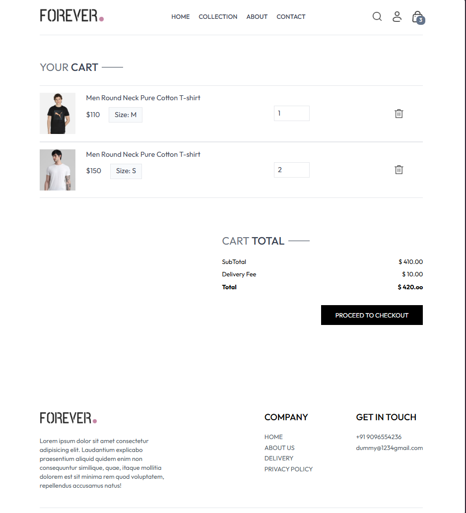

# 🛍️ E-Commerce Frontend App

A clean, responsive eCommerce frontend built using **React** and **Tailwind CSS**. This UI replicates a functional online store, featuring product listings, category filters, a shopping cart, and a modern shopping experience.

[🚀 Live Demo](https://ecommerce-ochre-ten-20.vercel.app/)

---

## 📸 Screenshots

### 🏠 Home Page


### 🛒 Cart Page



---

## 🚀 Features

- 🛍️ Product listing with images, price, and description
- 🧭 Category-based filtering
- 🛒 Shopping cart with quantity control
- 🌙 Responsive and mobile-friendly design
- ⚡ Fast and lightweight

---

## 🛠️ Tech Stack

- **React.js**
- **Tailwind CSS**
- **React Router**
- **Context API / Local Storage**

---

## 📦 Installation

```bash
git clone https://github.com/Dip290703/your-repo-name.git
cd your-repo-name
npm install
npm run dev
